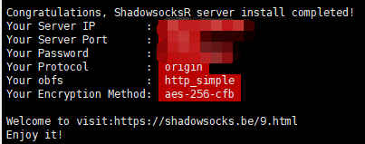

# SSR搭建及加速
该方案仅供参考，搭梯子不易，需科学上网。

## 选择VPS
目前所了解的VPS供应商如下：
1. [vultr](https://www.vultr.com/?ref=7915755)
2. [搬瓦工](https://banwagong.cn/)

## SSR搭建
1. 安装ShadowsocksR
```bash
yum install wget -y  # 一般在执行wget命令无效后需要进行安装

wget --no-check-certificate https://raw.githubusercontent.com/teddysun/shadowsocks_install/master/shadowsocksR.sh

chmod +x shadowsocksR.sh

./shadowsocksR.sh 2>&1 | tee shadowsocksR.log
```
执行完最后一条命令后，需要依次设置密码、端口（会随机分配一个）、加密方式（默认为aes-256-cfb，无特殊情况不需要更改）、协议（默认为origin）、混淆方式（默认为plain，免流选择http_simple）。

设置完成回车，等待几分钟完成后出现如图所示即为安装成功。



2. ShadowsocksR基本命令
```bash
/etc/init.d/shadowsocks start                   # 启动
/etc/init.d/shadowsocks stop                    # 停止
/etc/init.d/shadowsocks restart                 # 重启
/etc/init.d/shadowsocks status                  # 状态
/etc/shadowsocks.json                           # 配置文件路径
/var/log/shadowsocks.log                        # 日志文件路径
/usr/local/shadowsocks/shadowsoks               # 安装路径
```
后续更改SSR密码、端口等参数的话，直接更改/etc/shadowsocks.json的文件中配置即可。

3. ShadowsocksR多端口配置（可选项配置）
将shadowsocks.json中的`server_port`和`password`更改为`port_password`即可。例如：

单端口
```bash
{
  "server_port":"6600",
  "password":"password"
}
```

多端口
```bash
{
  "port_password":{
    "6600": "password"
    "6601": "password"
  }
}
```

## 安装锐速
这里只介绍CentOS7 x64 系统的安装方式。

1. 更换内核命令
```bash
wget --no-check-certificate -O rskernel.sh https://raw.githubusercontent.com/hombo125/doubi/master/rskernel.sh && bash rskernel.sh
```
回车后系统会自动下载脚本并执行更换内核命令，内核更换完毕后系统会自动重启并断开连接。

等待系统重启完毕后，重新连接服务器。

2. 安装锐速
```bash
yum install net-tools -y && wget --no-check-certificate -O appex.sh https://raw.githubusercontent.com/0oVicero0/serverSpeeder_Install/master/appex.sh && bash appex.sh install
```
中间的几次询问直接回车即可。

3. 锐速常用命令
```bash
/serverspeeder/bin/serverSpeeder.sh start        # 启动
/serverspeeder/bin/serverSpeeder.sh stop         # 停止
service serverSpeeder status                     # 状态
```

## 其他
SSR客户端（使用梯子的客户端使用），各系统连接工具下载请看[https://github.com/shadowsocks](https://github.com/shadowsocks)


